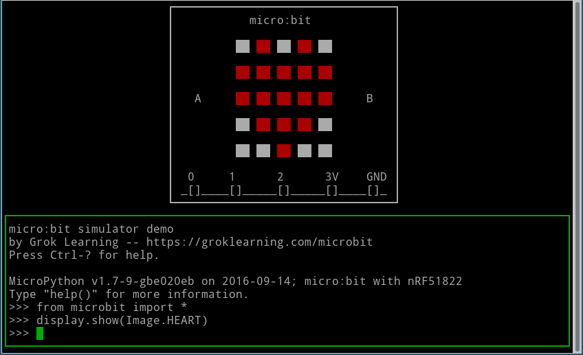

# micro:bit MicroPython simulator
Simulated implementation of the [micro:bit DAL](https://github.com/lancaster-university/microbit-dal/) by Grok Learning.

This repo provides three things that work with the [main micro:bit MicroPython repository](https://github.com/bbcmicrobit/micropython) to produce a simulator for the micro:bit running MicroPython firmware.
 - A simulated implementation of the DAL and mbed APIs.
 - A main() function.
 - A yotta target for x86 allowing the firmware to be built for Linux x86.

This was originally built to support the simulated micro:bit used in the [Grok Learning interface](https://groklearning.com/microbit), and also the auto-marker for student code. There are several features that support the marker but aren't crucial to the simulator.

It supports the following hardware features:
 - LEDs
 - Buttons
 - Pins (including PWM)
 - Music
 - Radio
 - Compass
 - Accelerometer
 - Temperature

## How it works
 
The idea is that the MicroPython firmware runs almost unmodified, but compiled for x86 instead of ARM. Any calls made to the DAL or mbed APIs are instead implemented by this library and provide equivalent functionality.

Input and output to the simulator works in three ways:
 - Serial is forwarded to stdin/stdout. This gives you the MicroPython REPL in the terminal.
 - Any device state changes/updates (e.g. LEDs, pins, radio, etc) are written to an output file (`___device_updates`) in the cwd.
 - Any input events (buttons, driving pins, accelerometer, compass, etc) are read from an input file (`___client_events`).

Instead of using files for device updates or input, two environment variables can be set with the file descriptor of a pipe. GROK_UPDATES_PIPE and GROK_CLIENT_PIPE. Inside the Grok server, these pipes are hooked up to a web socket back to the browser.

There are a few places where the MicroPython firmware bypasses the DAL, so we also provide implementations of the underlying APIs provided by mbed (e.g. `nrf_gpio_pin_set()`).

The associated fork of the micro:bit MicroPython repository has a [few small changes](https://github.com/groklearning/micropython/compare/master...groklearning:master-groksimulator):
 - An updated module.json to use microbit-simulated-dal instead of microbit-dal.
 - Removing a few unsupported modules (neopixels, audio, speech).
 - A small change to modrandom to support the marker.
 - Commenting out a few hardware accesses (e.g. direct register setting) that doesn't use higher-level APIs.

## Initial setup:
Clone the fork of bbcmicrobit/micropython and this repo.
```bash
cd ~/repos  # Change to your working dir.
git clone -b master-groksimulator git@github.com:groklearning/micropython.git bbcmicrobit-micropython-simulator
git clone -b master git@github.com:groklearning/microbit-simulated-dal.git
```

Set up the local copy of simulated DAL and the build target as yotta targets. This allows you to work on your local copy and have the main build pick it up.
```bash
pushd microbit-simulated-dal
sudo yotta link
pushd targets/x86-linux-native-32bit
sudo yotta link-target
popd
git submodule init
git submodule update
popd
```

Build for x86
```bash
cd bbcmicrobit-micropython-simulator
yotta link microbit-simulated-dal  # Ignore warning
yotta link-target x86-linux-native-32bit  # Ignore warning
yotta target x86-linux-native-32bit
yotta up
mkdir build
make inc/genhdr/qstrdefs.generated.h
yotta clean
yotta build
```

Development cycle:
```bash
yotta build
```

To pull changes from upstream:
```bash
git remote add upstream git@github.com:bbcmicrobit/micropython.git
git fetch upstream
git merge upstream/master
yotta clean
yotta build
```

## Running the simulator
Run interactively with no program (i.e. base firmware).
```bash
$ ./build/x86-linux-native-32bit/source/microbit-micropython 
MicroPython v1.7-9-gbe020eb on 2016-09-14; micro:bit with nRF51822
Type "help()" for more information.
>>> 
```

If you pass a program, it will run that program and terminate when the Python code finishes.
```bash
$ (echo 'from microbit import *'; echo 'display.show(Image.HEART)') > /tmp/program.py
$ ./build/x86-linux-native-32bit/source/microbit-micropython /tmp/program.py
MicroPython v1.7-9-gbe020eb on 2016-09-14; micro:bit with nRF51822
Type "help()" for more information.
>>>
soft reboot
(exit)
```

Just like CPython, you can all pass the `-i` flag to make it interactive.
```bash
$ ./build/x86-linux-native-32bit/source/microbit-micropython -i /tmp/program.py 
MicroPython v1.7-9-gbe020eb on 2016-09-14; micro:bit with nRF51822
Type "help()" for more information.
>>> 
```

Ctrl-C and Ctrl-D behave like on the serial console with a real micro:bit.

### Command-line GUI
The idea is that this simulator runs with some sort of frontend that is managing stdin/stdout/device_update/client_events. I plan to add a simple web server and HTML frontend that uses this.

In the meantime, there's a very rough curses-based command-line UI in `utils/gui.py`. Use Ctrl-O to switch between focusing the micro:bit or the serial console. It supports showing display updates, sending button events and the serial console.

`gui.py` expects to find the `microbit-micropython` binary in `$PATH`.

```bash
env PATH=${PATH}:path/to/bbcmicrobit-micropython-simulator/build/x86-linux-native-32bit/source/ path/to/microbit-simulated-dal/utils/gui.py [-i [path/to/program.py]]
```



## Input/output file format.
Each line of both `___client_events` and `___device_updates` (or their corresponding pipes, see above) is a complete JSON blob. This blob should be a list of objects. Here's an example output of `___device_updates` for the micro:bit starting up and showing Image.HEART.

```json
[{ "type": "microbit_leds", "ticks": 1, "data": {"b": [0,0,0,0,0,0,0,0,0,0,0,0,0,0,0,0,0,0,0,0,0,0,0,0,0]}}]
[{ "type": "microbit_pins", "ticks": 1, "data": {"p": [7,7,7,10,10,7,10,10,7,10,10,7,7,7,7,7,7,1,1,7,7,0,0], "pwmd": [0,0,0,0,0,0,0,0,0,0,0,0,0,0,0,0,0,0,0,0,0,0,0], "pwmp": [0,0,0,0,0,0,0,0,0,0,0,0,0,0,0,0,0,0,0,0,0,0,0]}}]
[{ "type": "microbit_radio_config", "ticks": 1, "data": { "enabled": false, "channel": 7, "base": 1969383796, "prefix": 0, "data_rate": 1 }}]
[{ "type": "microbit_leds", "ticks": 3, "data": {"b": [0,8,0,8,0,9,9,9,9,9,8,0,8,9,8,0,0,0,0,0,0,0,9,0,0]}}]
[{ "type": "microbit_leds", "ticks": 6, "data": {"b": [0,9,0,9,0,9,9,9,9,9,9,9,9,9,9,0,9,9,9,0,0,0,9,0,0]}}]
[{ "type": "microbit_bye", "ticks": 21, "data": { "real_ticks": "20" }}]
```

All updates are of the form `{"type": "", "ticks": N, "data": {}}`.

Here's an example line in `___client_events` to push down button A.

```json
[ { "type": "microbit_button", "data": { "id": 0, "state": 1 } } ]
```

Ticks are in "macro ticks" - i.e. 6ms. The simulator attempts to synchronize to real time as closely as possible.

You can use `utils/send-button.sh` to write to `___client_events` of a currently-running `microbit-micropython` process.
